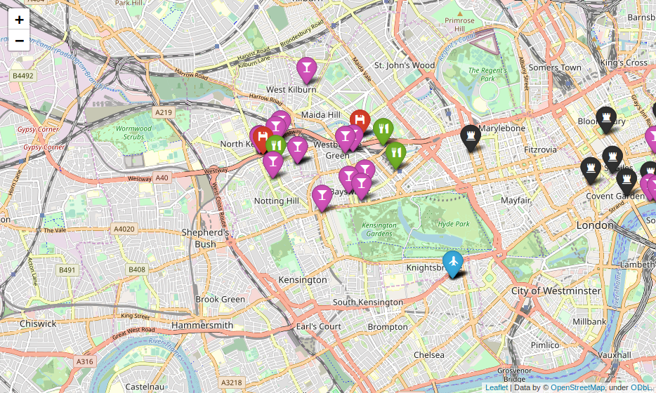

# Office Location Finder. Getting the best place for your new company's office.

### The Project:

The objective of this pipeline is to find the best localization for a new office to a hypothetical gaming company. To start, we got [a kaggle's dataset with companies information from Crunchbase](https://www.kaggle.com/mauriciocap/crunchbase2013) and a wishlist from the employees with requirements for the localization (available on the notebook folium.ipynb).

### The Code:

1. __create_collections.py__ produces a MongoDB collection inside our original Companies database, with all the available offices at the original dataset on a standard GeoJSON format. It also creates other collections that will be used later. 

2. __companiesdb.py__ analyzes the collection created above to define a set of target locations, near corporations, and tech startups. Outputs a JSON document with the target offices.

3. __google_api_requests.py__ takes a target_offices.json file created on step 2 to request to Google Places API some locations required to be in our optimal office area. 

4. __ranking.py__ processes the output from both *companiesdb.py* and *google_api_requests.py* on a Pandas dataframe to rank the target locations following the employee's wishlist. 

### The conclusion:

As a result of these processes, and looking for an office in Great Britain, I found an optimal area in west London, as you can see on the map below. The code for creating the map and the ranking process can be found on the folium.ipynb file. 

